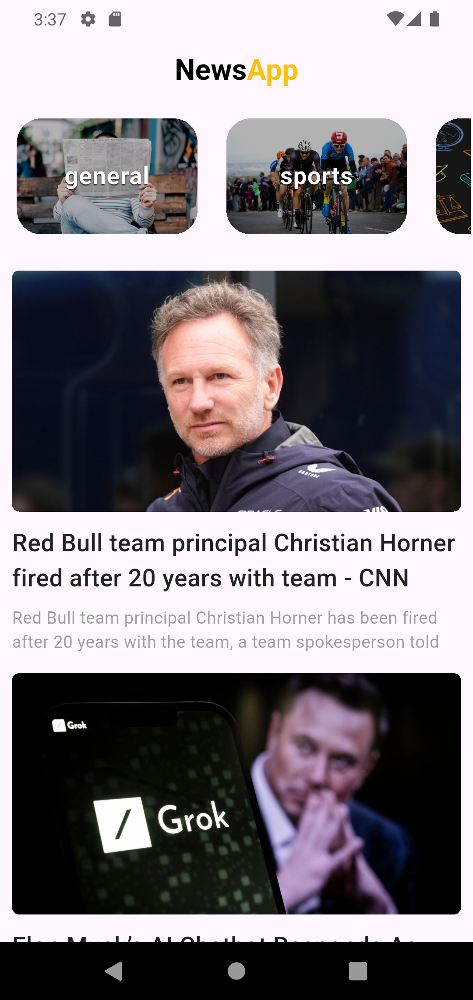
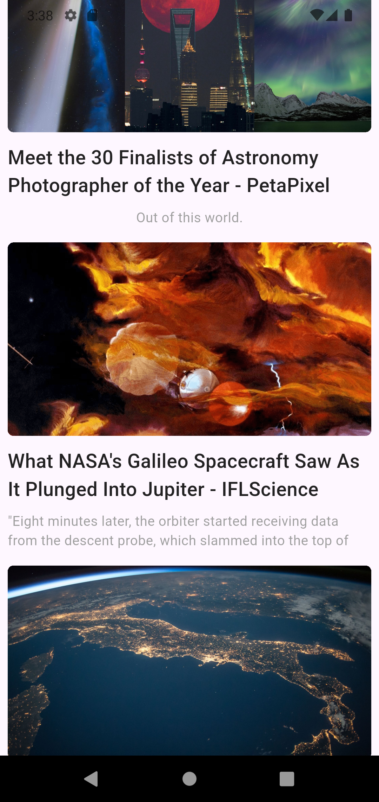
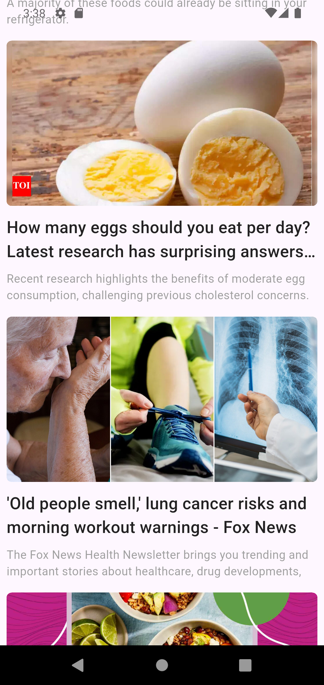

# 📰 Flutter News App – Beginner Friendly

Welcome! 👋  
This is a simple news app built using **Flutter**, created mainly for **learning and practice**.

## 📸 App Screenshots

  
  
  &nbsp;&nbsp;&nbsp;&nbsp;
  
  &nbsp;&nbsp;&nbsp;&nbsp;
  

---

## 💡 What does the app do?

It connects to a free News API and shows you the latest headlines in a clean list view. Each news card displays:
- 🖼 A thumbnail image  
- 📰 The article title  
- 📝 A short description  

You can use it to understand how networking works in Flutter and how to display real data on the screen.

---

## 🚀 Features

If you're just getting started with Flutter and want to explore how to:
- Make API calls
- Parse JSON data
- Build UI with ListView and images
- Work with asynchronous code

…then this app is for you!

---

## 🛠️ Technologies Used

- **Flutter** - Cross-platform mobile development
- **Dart** - Programming language
- **HTTP** - For API calls
- **JSON** - Data parsing

---

## 📱 Getting Started

1. Clone this repository
2. Run `flutter pub get` to install dependencies
3. Get your API key from [NewsAPI](https://newsapi.org/)
4. Add your API key to the project
5. Run `flutter run` to start the app

---

## 🤝 Contributing

Feel free to fork this project and submit pull requests. This is a learning project, so any improvements are welcome!

---

## 👨‍💻 Author

**Sahir Zakaria**

- 📧 Feel free to reach out for any questions or suggestions
- 🔗 Connect with me on social media
- ⭐ If you found this project helpful, please give it a star!

-  **GitHub:** [sahiralzakaria](https://github.com/sahiralzakaria)  
-  **LinkedIn:** [sahir-zakaria](https://www.linkedin.com/in/sahir-zakaria-39873531b)  
-  **Email:** sahir.alzakaria@gmail.com

---

  
Made with ❤️ by <strong>Sahir Zakaria</strong>

  
<em>Happy Coding! 🚀</em>

